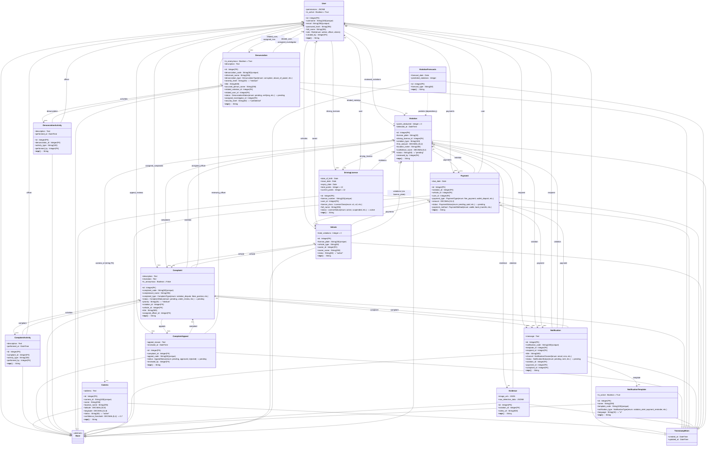

```mermaid
classDiagram
    %% Base classes
    class Base {
        <<abstract>>
    }
    class TimestampMixin {
        +created_at : DateTime
        +updated_at : DateTime
    }
    
    %% Main classes (attributes với Enum inline)
    class User {
        +id : Integer (PK)
        +username : String(100) (unique)
        +email : String(255) (unique)
        +password_hash : String(255)
        +full_name : String(255)
        +role : Role (enum: admin, officer, citizen)
        +permissions : JSONB
        +is_active : Boolean = True
        +created_by : Integer (FK)
        +__repr__() : String
    }
    
    class Camera {
        +id : Integer (PK)
        +camera_id : String(100) (unique)
        +name : String(255)
        +location_name : String(255)
        +latitude : DECIMAL(10,8)
        +longitude : DECIMAL(11,8)
        +address : Text
        +status : String(50) = "active"
        +confidence_threshold : DECIMAL(5,4) = 0.7
        +__repr__() : String
    }
    
    class ComplaintActivity {
        +id : Integer (PK)
        +complaint_id : Integer (FK)
        +activity_type : String(100)
        +description : Text
        +performed_by : Integer (FK)
        +performed_at : DateTime
        +__repr__() : String
    }
    
    class ComplaintAppeal {
        +id : Integer (PK)
        +complaint_id : Integer (FK)
        +appeal_code : String(50) (unique)
        +appeal_reason : Text
        +status : AppealStatus (enum: pending, approved, rejected) = pending
        +reviewed_by : Integer (FK)
        +reviewed_at : DateTime
        +__repr__() : String
    }
    
    class Complaint {
        +id : Integer (PK)
        +complaint_code : String(50) (unique)
        +complainant_name : String(255)
        +complaint_type : ComplaintType (enum: violation_dispute, false_positive, etc.)
        +status : ComplaintStatus (enum: pending, under_review, etc.) = pending
        +priority : String(20) = "medium"
        +violation_id : Integer (FK)
        +vehicle_id : Integer (FK)
        +title : String(500)
        +description : Text
        +assigned_officer_id : Integer (FK)
        +resolution : Text
        +is_anonymous : Boolean = False
        +__repr__() : String
    }
    
    class DenunciationActivity {
        +id : Integer (PK)
        +denunciation_id : Integer (FK)
        +activity_type : String(100)
        +description : Text
        +performed_by : Integer (FK)
        +performed_at : DateTime
        +__repr__() : String
    }
    
    class Denunciation {
        +id : Integer (PK)
        +denunciation_code : String(50) (unique)
        +is_anonymous : Boolean = True
        +informant_name : String(255)
        +denunciation_type : DenunciationType (enum: corruption, abuse_of_power, etc.)
        +severity_level : String(20) = "medium"
        +title : String(500)
        +description : Text
        +accused_person_name : String(255)
        +related_violation_id : Integer (FK)
        +related_user_id : Integer (FK)
        +status : DenunciationStatus (enum: pending, verifying, etc.) = pending
        +assigned_investigator_id : Integer (FK)
        +security_level : String(50) = "confidential"
        +__repr__() : String
    }
    
    class DrivingLicense {
        +id : Integer (PK)
        +license_number : String(20) (unique)
        +user_id : Integer (FK)
        +license_class : LicenseClass (enum: a1, a2, etc.)
        +full_name : String(255)
        +date_of_birth : Date
        +issue_date : Date
        +expiry_date : Date
        +total_points : Integer = 12
        +current_points : Integer = 12
        +status : LicenseStatus (enum: active, suspended, etc.) = active
        +__repr__() : String
    }
    
    class Evidence {
        +id : Integer (PK)
        +violation_id : Integer (FK)
        +image_urls : JSON
        +video_url : String(500)
        +raw_detection_data : JSONB
        +__repr__() : String
    }
    
    class NotificationTemplate {
        +id : Integer (PK)
        +name : String(255)
        +template_code : String(100) (unique)
        +notification_type : NotificationType (enum: violation_alert, payment_reminder, etc.)
        +language : String(10) = "vi"
        +is_active : Boolean = True
        +__repr__() : String
    }
    
    class Notification {
        +id : Integer (PK)
        +notification_code : String(100) (unique)
        +template_id : Integer (FK)
        +recipient_id : Integer (FK)
        +title : String(500)
        +message : Text
        +channel : NotificationChannel (enum: email, sms, etc.)
        +status : NotificationStatus (enum: pending, sent, etc.) = pending
        +violation_id : Integer (FK)
        +payment_id : Integer (FK)
        +complaint_id : Integer (FK)
        +__repr__() : String
    }
    
    class Payment {
        +id : Integer (PK)
        +violation_id : Integer (FK)
        +vehicle_id : Integer (FK)
        +user_id : Integer (FK)
        +payment_type : PaymentType (enum: fine_payment, wallet_deposit, etc.)
        +amount : DECIMAL(15,2)
        +status : PaymentStatus (enum: pending, paid, etc.) = pending
        +payment_method : PaymentMethod (enum: wallet, bank_transfer, etc.)
        +due_date : Date
        +__repr__() : String
    }
    
    class Vehicle {
        +id : Integer (PK)
        +license_plate : String(20) (unique)
        +vehicle_type : String(50)
        +owner_id : Integer (FK)
        +owner_name : String(255)
        +total_violations : Integer = 0
        +status : String(50) = "active"
        +__repr__() : String
    }
    
    class ViolationForecasts {
        +id : Integer (PK)
        +forecast_date : Date
        +forecast_type : String(50)
        +predicted_violations : Integer
        +__repr__() : String
    }
    
    class Violation {
        +id : Integer (PK)
        +license_plate : String(20)
        +driving_license_id : Integer (FK)
        +violation_type : String(100)
        +points_deducted : Integer = 0
        +fine_amount : DECIMAL(15,2)
        +location_name : String(255)
        +detected_at : DateTime
        +confidence_score : DECIMAL(5,4)
        +status : String(50) = "pending"
        +reviewed_by : Integer (FK)
        +__repr__() : String
    }
    
    %% Inheritance (all main classes inherit from Base and TimestampMixin)
    User --|> Base
    User --|> TimestampMixin
    Camera --|> Base
    Camera --|> TimestampMixin
    ComplaintActivity --|> Base
    ComplaintAppeal --|> Base
    ComplaintAppeal --|> TimestampMixin
    Complaint --|> Base
    Complaint --|> TimestampMixin
    DenunciationActivity --|> Base
    Denunciation --|> Base
    Denunciation --|> TimestampMixin
    DrivingLicense --|> Base
    DrivingLicense --|> TimestampMixin
    Evidence --|> Base
    Evidence --|> TimestampMixin
    NotificationTemplate --|> Base
    NotificationTemplate --|> TimestampMixin
    Notification --|> Base
    Notification --|> TimestampMixin
    Payment --|> Base
    Payment --|> TimestampMixin
    Vehicle --|> Base
    Vehicle --|> TimestampMixin
    ViolationForecasts --|> Base
    ViolationForecasts --|> TimestampMixin
    Violation --|> Base
    Violation --|> TimestampMixin
    
    %% Associations/Relationships (giữ nguyên để đầy đủ)
    %% User relationships
    User --> "many" Violation : reviewed_violations
    User --> "many" Complaint : assigned_complaints
    User --> "many" ComplaintAppeal : appeal_reviews
    User --> "many" DrivingLicense : driving_licenses
    User --> "many" Vehicle : vehicles
    User --> "many" Payment : payments
    User --> "many" Notification : recipient
    User --> "many" Denunciation : related_user, assigned_investigator
    
    %% Complaint ecosystem
    Complaint --> "one" Violation : violation
    Complaint --> "one" Vehicle : vehicle
    Complaint --> "one" User : assigned_officer
    Complaint --> "many" ComplaintAppeal : appeals
    Complaint --> "many" ComplaintActivity : activities
    Complaint --> "many" Notification : complaint
    ComplaintAppeal --> "one" Complaint : complaint
    ComplaintAppeal --> "one" User : reviewing_officer
    ComplaintActivity --> "one" Complaint : complaint
    ComplaintActivity --> "one" User : officer
    
    %% Denunciation ecosystem
    Denunciation --> "one" Violation : related_violation
    Denunciation --> "one" User : related_user, assigned_investigator
    Denunciation --> "many" DenunciationActivity : activities
    DenunciationActivity --> "one" Denunciation : denunciation
    DenunciationActivity --> "one" User : officer
    
    %% Violation ecosystem
    Violation --> "one" DrivingLicense : driving_license
    Violation --> "many" Payment : payments
    Violation --> "one" Evidence : evidence
    Violation --> "many" Notification : violation
    Violation --> "many" Complaint : complaints
    Evidence --> "one" Violation : violation
    Violation --> "one" Camera : camera_id (string FK)
    
    %% Vehicle relationships
    Vehicle --> "one" User : owner
    Vehicle --> "many" Payment : payments
    Vehicle --> "many" Violation : violations (via license_plate)
    Vehicle --> "one" Complaint : vehicle
    
    %% DrivingLicense
    DrivingLicense --> "one" User : user
    DrivingLicense --> "many" Violation : violations
    
    %% Payment
    Payment --> "one" Violation : violation
    Payment --> "one" Vehicle : vehicle
    Payment --> "one" User : user
    Payment --> "many" Notification : payment
    
    %% Notification ecosystem
    Notification --> "one" NotificationTemplate : template
    Notification --> "one" User : recipient
    Notification --> "one" Violation : violation
    Notification --> "one" Payment : payment
    Notification --> "one" Complaint : complaint
    
    %% Other (less connected)
    ViolationForecasts ..> Violation : predicts (dependency)
```