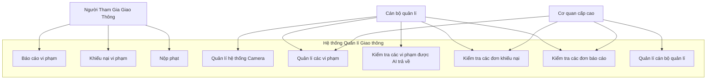

```mermaid
graph TD
    %% Định nghĩa các Actor (Tác nhân)
    actor[Người Tham Gia Giao Thông]
    actor1[Cán bộ quản lí]
    actor2[Cơ quan cấp cao]

    %% Bắt đầu Use Case Diagram (Use Cases nằm trong System Boundary - Ranh giới hệ thống)
    subgraph Hệ thống Quản lí Giao thông
        %% Use Cases dành cho Người Tham Gia Giao Thông
        uc1[Báo cáo vi phạm]
        uc2[Khiếu nại vi phạm]
        uc3[Nộp phạt]

        %% Use Cases dành cho Cán bộ quản lí & Cơ quan cấp cao
        uc4[Quản lí hệ thống Camera]
        uc5[Quản lí các vi phạm]
        uc6[Kiểm tra các vi phạm được AI trả về]
        uc7[Kiểm tra các đơn khiếu nại]
        uc8[Kiểm tra các đơn báo cáo]
        uc9[Quản lí cán bộ quản lí]
    end

    %% Mối quan hệ giữa Actor và Use Case (Associations)

    %% Người Tham Gia Giao Thông
    actor --> uc1
    actor --> uc2
    actor --> uc3

    %% Cán bộ quản lí
    actor1 --> uc4
    actor1 --> uc5
    actor1 --> uc6
    actor1 --> uc7
    actor1 --> uc8

    %% Cơ quan cấp cao
    actor2 --> uc5
    actor2 --> uc7
    actor2 --> uc8
    actor2 --> uc9

    %% Lưu ý: Mermaid không có ký hiệu đặc biệt cho các mối quan hệ như trên hình (ví dụ: các dấu X trên 'Quản lí các vi phạm' hoặc các mũi tên/đường cong nhẹ).
    %% Đoạn mã này tập trung tái hiện các Actors, Use Cases và các mối liên kết chính xác nhất.
```