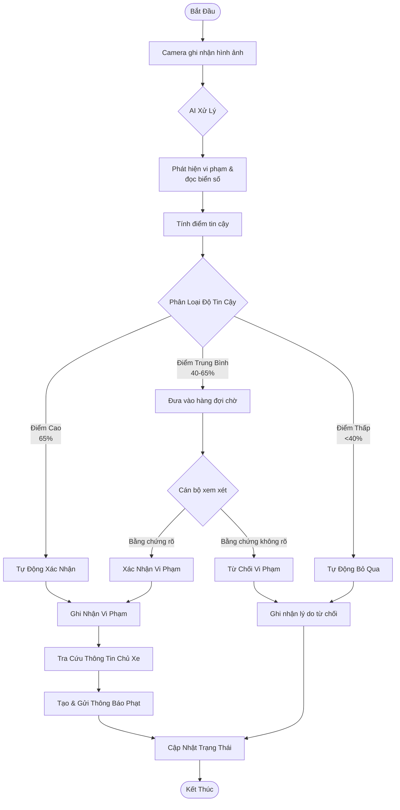

```mermaid
flowchart TD
    Start([Bắt Đầu]) --> A[Camera ghi nhận hình ảnh]
    A --> B{AI Xử Lý}
    
    B --> C[Phát hiện vi phạm &<br>đọc biển số]
    C --> D[Tính điểm tin cậy]
    
    D --> E{Phân Loại Độ Tin Cậy}
    
    E -- Điểm Cao<br>65% --> F[Tự Động Xác Nhận]
    E -- Điểm Trung Bình<br>40-65% --> G[Đưa vào hàng đợi chờ]
    E -- Điểm Thấp<br><40% --> H[Tự Động Bỏ Qua]
    
    G --> I{Cán bộ xem xét}
    I -- Bằng chứng rõ --> J[Xác Nhận Vi Phạm]
    I -- Bằng chứng không rõ --> K[Từ Chối Vi Phạm]
    
    F --> L[Ghi Nhận Vi Phạm]
    J --> L
    K --> M[Ghi nhận lý do từ chối]
    H --> M
    
    L --> N[Tra Cứu Thông Tin Chủ Xe]
    N --> O[Tạo & Gửi Thông Báo Phạt]
    
    O --> P[Cập Nhật Trạng Thái]
    M --> P
    
    P --> Q([Kết Thúc])
```